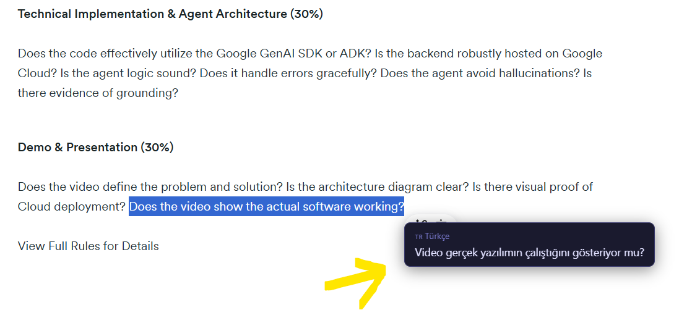

# select_translate_extension_v1
Instant Translate - Browser Extension (v1.0)

Instant Translate is a lightweight Google Chrome extension designed to streamline the translation process while browsing. It utilizes the Google Translate API to provide immediate, in-place Turkish translations of selected text via a non-intrusive tooltip, eliminating the need to navigate to external translation services.

1. Basic Usage (Foreign Language to Turkish)
Upon selecting text in a foreign language, the extension automatically detects the source language and renders the Turkish translation within a customized tooltip.

2. Loading State
A visual indicator is displayed immediately upon text selection while the API request is being processed asynchronously.

3. Viewport Boundary Detection
The tooltip dynamically calculates coordinates to ensure it remains entirely within the visible viewport, preventing overflow on the screen edges.

Features
Instant In-Place Translation: Initiates translation automatically upon text selection and mouse release, incorporating a 300ms debounce to optimize performance.

Automatic Language Detection: Identifies the source language automatically without requiring user configuration.

Modern UI: Features a dark-themed, minimalist tooltip with smooth CSS3 transitions.

Smart Positioning: Implements dynamic coordinate calculation to prevent the tooltip from rendering outside the browser window.

Intuitive Dismissal: The tooltip can be closed instantly by clicking outside the element or pressing the Escape key.

API Optimization: Caches the last translated string to prevent redundant API calls for consecutive identical selections.

Installation (Developer Mode)
As this extension is currently not published on the Chrome Web Store, it must be loaded locally as an unpacked extension:

Download or clone this repository to your local machine. Ensure the directory structure is exactly as follows:

Plaintext
aninda-ceviri/
├── manifest.json
├── content.js
└── style.css
Open Google Chrome (or any Chromium-based browser such as Edge or Brave).

Navigate to chrome://extensions/ in the address bar.

Enable Developer mode via the toggle switch in the top right corner.

Click the Load unpacked button located in the top left corner.

Select the aninda-ceviri directory you created.

The extension is now installed and active across all web pages.

Technologies Used
JavaScript (ES6+): Core extension logic, DOM manipulation, and asynchronous API handling.

HTML5 & CSS3: Tooltip structure, custom styling, and animations.

Chrome Extension API: Built on the Manifest V3 architecture.

Google Translate API: Utilizing the gtx endpoint for translation fetching.

License
This project is licensed under the MIT License.   
